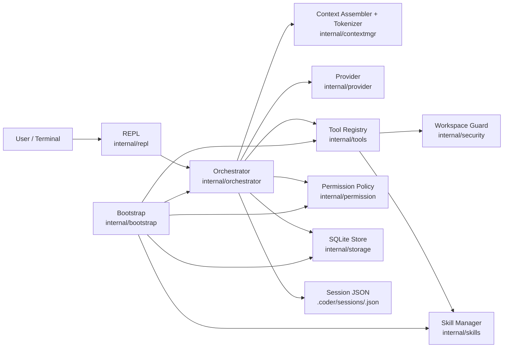
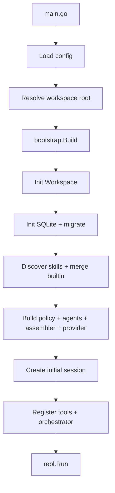
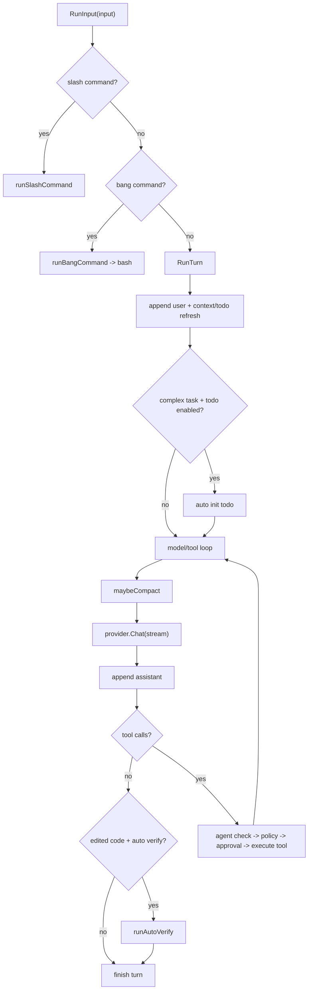

# Coder 设计文档（代码对齐版）

## 1. 文档目标
本文档基于当前实现（`2026-02-11`）描述系统架构、关键流程与模块职责，作为需求文档的技术落地说明。

## 2. 系统架构图

## 3. 启动流程图

## 4. 单回合执行流程图

## 5. 核心模块设计
### 5.1 REPL（`internal/repl`）
- 双行提示符渲染（context/model 与 mode/cwd）。
- TTY raw 输入、多行粘贴识别、Ctrl+C 中断。
- 非 TTY 模式按 EOF 聚合输入。

### 5.2 Orchestrator（`internal/orchestrator`）
- 统一输入分发：普通回合 / `!` / `/`。
- 模型工具循环、todo 自动初始化、自动验证。
- 会话状态管理（messages、context stats、mode、active agent）。

### 5.3 Tools（`internal/tools`）
- 文件工具：`read/list/glob/grep/write/edit/patch`
- 执行工具：`bash`
- 任务工具：`todoread/todowrite/skill/task`
- 统一注册表 + optional 审批接口（`ApprovalAware`）。

### 5.4 安全与权限
- `security.Workspace`：路径边界和符号链接防逃逸。
- `permission.Policy`：工具级与 bash pattern 级 `allow/ask/deny`。
- `bash` 风险检查：命令替换、解析失败、危险命令、覆盖重定向。

### 5.5 存储与会话
- SQLite 持久化：sessions/messages/todos/permission_log。
- 会话 JSON 快照：便于离线审阅与重放。
- `/resume` 依赖存储中的消息恢复。

## 6. 关键数据结构
- `chat.Message`：OpenAI 兼容消息（含 tool call 字段）。
- `chat.ToolDef`：OpenAI function tool 描述。
- `storage.SessionMeta`、`storage.TodoItem`：会话与 todo 状态。

## 7. 当前实现约束与已知差异
- `/mode` 目前主要是会话展示状态，不直接改变策略引擎决策。
- `/undo` 为整工作区 git 回滚（`git restore . && git clean -fd`），不是“按回合精确撤销”。
- 自动验证命令选择为“配置优先 + 项目类型启发式”，当前未启用固定白名单硬约束。

## 8. 与需求文档映射
- 交互与界面：`docs/requirements/01-产品形态与界面.md`
- 状态流与编排：`docs/requirements/02-交互逻辑与状态流.md`
- 工具与安全：`docs/requirements/03-工具能力清单.md`、`docs/requirements/04-安全与权限规则.md`
- 配置与运行：`docs/requirements/06-配置与运行规则.md`
