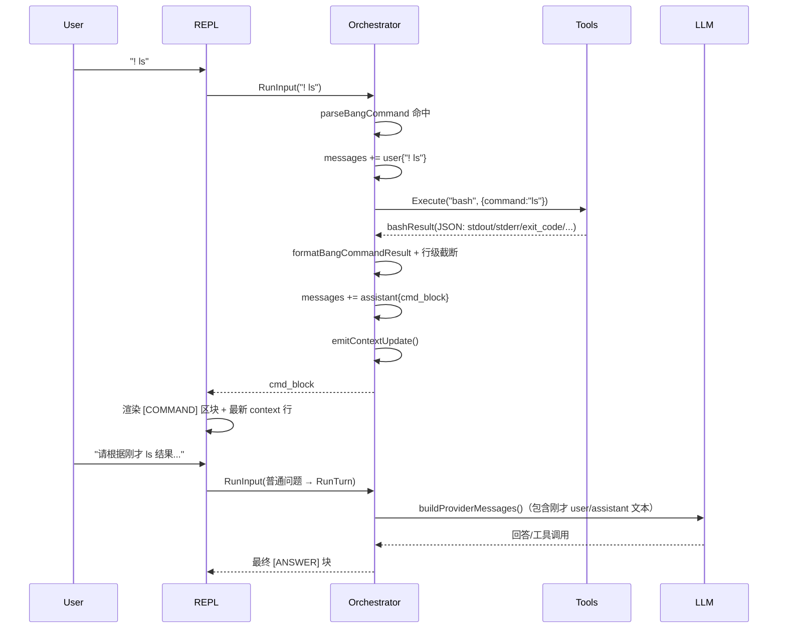

# 09. REPL 交互与渲染实现（目标态）

## 1. 提示符与输入区
- **第一行**：固定展示 `context: N tokens · model: xxx`（当前 context 的 tokens 数与当前 model）；与正文区分，弱化辅助信息（见颜色约定）。
- **第二行**：提示符 `[mode] /path/to/cwd> ` 及用户输入区；cwd 仅在此行展示，第一行不重复。
- 凡出现用户输入提示符时，必须展示上述两行；不可省略。

示例：
- 第一行：`context: 1200 tokens · model: gpt-4o`
- 第二行：`[build] /Users/dev/myapp> `（或后接用户已输入内容）

## 2. 输入规则
- **发送**：Enter 即发送当前输入。单行时直接 Enter 发送；多行仅支持粘贴：粘贴后终端显示 `[copy N lines]`，再按 Enter 发送该多行内容。TTY 下为 raw 模式；非 TTY（管道）下按行或 EOF 读取。
- **Tab 模式切换**：仅当输入框为空时，Tab 在 `build` 与 `plan` 之间切换；当输入框非空时，Tab 保持输入编辑行为。
- **输入历史（↑/↓）**：与典型 Linux 终端行为接近。在输入态下，↑ 可调出上一条用户输入，连续按 ↑ 逐条回溯直至最早记录并停留；↓ 则在历史中向前移动，越过最新记录后返回到“空输入行”（不保留中途编辑内容）。历史仅包含当前 REPL 进程内已成功提交的输入行。
- **输入分支**：
  - `!` 前缀：命令模式，直走 `bash`。
  - `/` 前缀：内建命令。
  - 普通文本：进入模型-工具循环。

## 3. 模式切换
- 通过内建命令切换：`/mode <build|plan>` 或 `/build`、`/plan`。
- 切换后提示符立即体现当前模式（第二行 `[mode]` 更新）。

## 4. 流式输出
- 所有输出按时间顺序写入同一 stdout 流：用户消息、助手回复、工具摘要、日志文本。
- 助手文本按 chunk 增量追加显示。
- `thinking`（模型思考过程）在输出流内直接全文展示，不折叠。
- 工具开始：记录工具名与简洁摘要；工具完成：展示结构化摘要；若有详细输出（如 write 的 diff），在同一输出流内直接展示，不提供折叠/展开。
- `write`/`patch` 返回 diff 时，以 **unified diff 文本**（单列 `+`/`-`/`@@`）在输出流内展示，不做左右并排视图；diff 在工具完成时直接展示，无需额外操作。
- 历史通过终端滚动回看。

## 5. 颜色约定
实现时可采用 ANSI 色或终端 256 色对应，与需求 01 第 8 节一致：

| 类别 | 颜色 | 说明 |
|------|------|------|
| context 行（第一行 tokens · model） | 灰色 / dim | 与正文区分，弱化辅助信息 |
| 提示符（`[mode] /path> `） | 绿色 / green | 标识输入位置 |
| 用户输入 | 默认前景色 | 与助手回复同层级 |
| 助手正文 / ANSWER 块 | 默认前景色 | 正文主色；**无左侧竖线**，仅保留 `[ANSWER]` 标题与正文 |
| thinking | 灰色 / dim，可选斜体 | 与正文区分，表示“中间过程” |
| 工具名/工具事件（如 `[tool] read`、`[bash]`） | 蓝色 / blue | 标识工具调用 |
| 工具成功 | 绿色 / green | 表示成功 |
| 工具失败/错误 | 红色 / red | 表示失败或需关注 |
| diff 新增行（`+` 行） | 绿色 / green | 与通用 diff 习惯一致 |
| diff 删除行（`-` 行） | 红色 / red | 与通用 diff 习惯一致 |
| diff 元信息（`---`、`+++`、`@@`） | 灰色 / dim | 弱化元信息 |
| 系统/审批/自动验证等提示 | 黄色 / yellow | 标识系统级或需确认信息 |
| Todos 列表项 | 按状态 | **done** = 青 (cyan)；**in_progress** = 黄/橙 (yellow/orange)；**pending** = 灰 (dim/gray) |
| 错误与异常 | 红色 / red | 明确错误态 |

未列出的输出（如文件列表、命令 stdout 原文）使用默认前景色。若终端不支持多色，至少区分：正文（默认）、错误/失败（红或高亮）、提示符（绿或高亮）。

## 6. 交互与中断
- **Ctrl+C**：进程级中断（退出程序）。
- **Esc（输入编辑态）**：清空当前输入框，不提交。
- **Esc（运行态）**：业务级全局取消，停止当前模型流式输出、tool-call、审批等待和自动重试链路，并打印统一提示：
  - `Cancelled by ESC`
  - `Stopped model stream and tool execution; todo state remains unchanged unless a tool had already completed.`
- 界面极简：使用终端默认样式（等宽字体、少颜色、少装饰）。

## 7. 状态与按需查看
- **Context（tokens）与 model**：在每次等待输入时于第一行展示；由编排器或 REPL 层在显示提示符前提供当前 context 与 model。
- **Todos**：在对话流中随回合展示；可通过 `/todos` 仅查看当前列表（只读）。
- **Tools、Skills**：通过 `/tools`、`/skills` 按需查看，非固定侧栏。

## 8. 审批交互
- 触发场景：当工具调用（包含命令模式 `!`）在策略层或工具层判定为 `ask` 时触发审批交互。
- 策略层 `ask`（如 `bash policy requires approval`）：在 stdout 打印待执行命令与说明，从 REPL 读审批输入（y/n/always）后继续；`always` 表示将该命令记录到项目级 allowlist，后续相同命令在策略层自动放行。
- 工具层危险命令风险审批（如 `matches dangerous command policy`）：在 stdout 打印命令与说明，仅接受 y/n（不提供 `always`）。
- 审批等待期间按 `Esc`：触发全局取消（等价 Cancel 整条自动化流程），不是 `N`。
- 非交互模式（`auto_approve_ask=true` 或 `approval.interactive=false`）：不阻塞，自动放行策略层 `ask`，但危险命令风险审批仍需显式 y/n 或按配置拒绝执行。

## 9. Question 交互（plan mode）
- **触发场景**：plan mode 下模型通过 `question` tool call 发起提问。
- **终端渲染**：逐个展示问题，格式如下：
  ```
  [Question 1/3] 你希望如何处理这个模块？
    1. 重构整个模块 (Recommended)
    2. 只修改核心函数
    3. 保持不变，添加新模块

  >
  ```
  - 多个问题时显示 `[Question M/N]`，单个问题时显示 `[Question]`。
  - 第一个选项自动追加 `(Recommended)` 标记。
  - 若选项有 description，以 ` — description` 追加在 label 后。
- **用户输入**：
  - 输入数字（如 `2`）→ 返回对应选项的 label 文本。
  - 输入任意文本 → 原样返回作为自定义回复。
  - 空输入（直接 Enter）→ 不提交，保持等待。
  - Esc → 取消全部问题（已回答部分也丢弃），返回取消信号给模型。
  - Ctrl+C → 进程级中断。
  - Backspace → 编辑当前输入。
- **实现**：`runtimeController` 实现 `tools.QuestionPrompter` 接口，通过 `questionReq` channel 与 `loop()` 主循环通信（与审批交互并行处理，不可同时存在两个交互）。
- **context 注入**：REPL loop 中通过 `tools.WithQuestionPrompter(ctx, rtCtrl)` 注入。

## 10. 状态同步（Orchestrator 驱动）
Orchestrator 在步进/回合结束时通过回调或写出的方式，将需展示的内容输出到同一 stdout 流：
- 文本 chunk
- reasoning chunk
- tool start / tool done
- context 统计（用于下次显示提示符第一行）
- session/model 更新（影响提示符与持久化）

提示符在每次显示前由编排器或 REPL 层提供当前 context 与 model；不保留“侧栏推送”表述。

## 10. 错误可见性
- 命令错误、工具错误、权限拒绝均在 stdout 可读展示。
- 流式中断后保留已接收内容，且明确标注中断状态。

## 11. 命令模式（`!`）与上下文

### 11.1 流程概览（时序）

命令模式在 `RunInput` 层做分流，仅在行首以 `!` 开头时走该路径，**不触发模型调用**，但会写入消息历史并刷新上下文统计：



### 11.2 实现要点

- **入口与分流**：
  - `RunInput` 内部通过 `parseBangCommand` 判断是否为命令模式；命中后调用 `runBangCommand`，否则走 `/` 内建命令或 `RunTurn`（模型-工具循环）。
  - `runBangCommand` 首先追加一条 `user` 消息，内容为原始输入（例如 `"! ls"`），确保命令本身在后续模型上下文中可见。
- **命令执行与风险模型**：
  - 命令模式通过 `bash` 工具执行命令，并复用 Agent/Policy/审批链（与普通 tool call 一致）。
  - 仍受工具层安全配置约束：`command_timeout_ms` 与 `output_limit_bytes`；`bash` 在 JSON 结果中返回 `exit_code`、`stdout`、`stderr`、`truncated`、`duration_ms` 等字段。
  - 是否允许调用 `bash` 仅由 `activeAgent.ToolEnabled["bash"]` 控制；禁止时返回 `command mode denied: bash disabled by active agent <name>` 的 `assistant` 文本。
- **渲染与 `[COMMAND]` 区块**：
  - `formatBangCommandResult` 将 `bash` 的 JSON 结果格式化为人类可读文本 `cmd_block`，包括：
    - `$ <command>` 行（命令回显）；
    - `exit=<code> duration=<xx>ms` 行（附 ` (truncated)` 标记表示底层字节截断）；
    - `stdout:` 段与 `stderr:` 段（如有）；
    - 在无任何输出时附加 `(no output)` 行。
  - `runBangCommand` 将 `cmd_block` 追加为一条 `assistant` 消息，并调用 `renderCommandBlock` 将其渲染为单独的 `[COMMAND]` 区块；旧版的 `[command mode]` 文本头已移除，仅保留 `[COMMAND]` 头与正文。
- **输出截断策略（双层）**：
  - **字节级截断（底层工具）**：`bash` 使用 `output_limit_bytes` 限制 stdout/stderr 缓冲区大小，超出部分被丢弃并在文本末尾追加 `"[output truncated]"` 行，同时在 JSON 中设置 `truncated=true`。
  - **行级截断（展示层）**：`formatBangCommandResult` 仅对 stdout/stderr 的**展示文本**按行数做二次截断：
    - 每个段最多展示前 N 行（当前实现约 20 行，可通过常量调整）；
    - 被行级截断时，在对应段末尾追加 `...[output truncated for display]` 或 `...[error output truncated for display]` 一行提示；
    - 仅影响渲染给用户的文本，不修改 `bash` 返回的原始 JSON 内容。
- **上下文与 context 行刷新**：
  - 命令模式不会调用 LLM，但其 `user("! ...")` 与 `assistant(cmd_block)` 均写入 `o.messages`，在下一次 `RunTurn` 时通过 `buildProviderMessages()` 一并发给模型。
  - `runBangCommand` 结束前调用 `emitContextUpdate()`，基于最新消息序列与 `context_token_limit` 估算 tokens，触发 `OnContextUpdate` 回调；REPL 利用该回调在下一次提示符前重绘 `context: <tokens> · model: <name>` 行，使命令输出对上下文大小的影响在 UI 上立刻可见。
